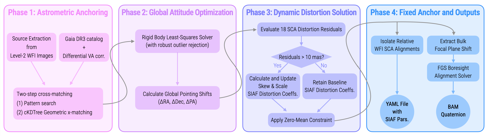

# Roman Space Telescope Pointing Calibration

This repository contains the commissioning pipeline for the Nancy Grace Roman Space Telescope's pointing calibration. It provides a modular, flight-ready toolkit to align the 18 Wide Field Instrument (WFI) Sensor Chip Assemblies (SCAs) and calibrate the Fine Guidance Sensor (FGS) boresight relative to the spacecraft body frame.

## Flowchart



## Core Capabilities

* **High-Fidelity Astrometry:** Dual-path source extraction utilizing either rapid 2D Gaussian centroiding (`photutils`) or high-precision Effective PSFs (ePSF) generated via optical models from `stpsf`.
* **Kinematic Transformations:** Exact spherical Differential Velocity Aberration (DVA) scaling and proper motion propagation from Gaia DR3, optimized to handle LMC zero-parallax kinematics.
* **WFI Macroscopic Alignment:** Solves the global attitude and local focal plane geometry of the 18 SCAs, preserving true physical detector plate residuals without artificial zero-mean constraints.
* **FGS Boresight Calibration:** Solves Wahba's problem using WFI cross-matched star catalogs and flight ephemeris to derive the updated Body-to-FGS quaternion (`SCF_AC_FGS_TBL_Qb`).

## Installation

This package is designed to be installed in "editable" mode, allowing you to run the extraction and alignment scripts from any data directory while maintaining a centralized codebase.

```bash
git clone [https://github.com/tonysohn/roman-pointing-calibration.git](https://github.com/YOUR_USERNAME/roman-pointing-calibration.git)
cd roman-pointing-calibration
pip install -e .
```

## Usage

The pipeline is split into two primary runner scripts located in the `scripts/` directory.

1. Batch Source Extraction

Navigate to your directory containing the Level 2 ASDF files and execute the extraction script. This will generate `.ecsv` catalogs for each SCA.
(Note: You can toggle between 'gaussian' and 'epsf' methods directly inside the script).

```bash
cd /path/to/commissioning/data/
python /path/to/roman-pointing-calibration/scripts/batch_extraction.py
```

2. Alignment & Calibration

Once the catalogs are extracted, run the master calibration solver. This will fetch the reference catalog, apply DVA, execute the macro-alignment loop, and calculate the boresight delta.

```bash
python /path/to/roman-pointing-calibration/scripts/run_calibration.py
```

## Outputs
* `calibrated_roman_siaf.yml`: The updated geometric definitions for the 18 SCAs.
* Diagnostic PNGs: Overlays of extracted sources and 2x2 grid quiver plots of focal plane residuals.
* Standard out logging detailing the ΔRA, ΔDec, ΔPA, and the updated BAM telemetry quaternion.
